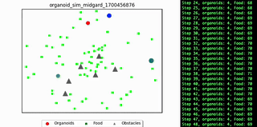

# organoids
NN powered Single celled organism simulation

# about

This is a passion project of mine to create an open-source ecology simulator powered by a flexible NN architecture.
While it's currently a simple implementation, it may serve as the base for more complex projects in the future.

# getting started

The organoids module contains five classes of objects:
 - NN: Neural network with configurable amount of hidden layers
 - Organoids: agents of the world powered by NNs
 - Obstacles: simply random areas the organoids must navigate around
 - Food: resources required to grow and sustain organoids
 - World: simulated ecosystem, configurable with varying size, abundance, replishment, and obstacles

To run the simulation, edit the values in `run.py` and execute.

# example

```bash
pip install -r requirements.txt
python ./run.py
```

